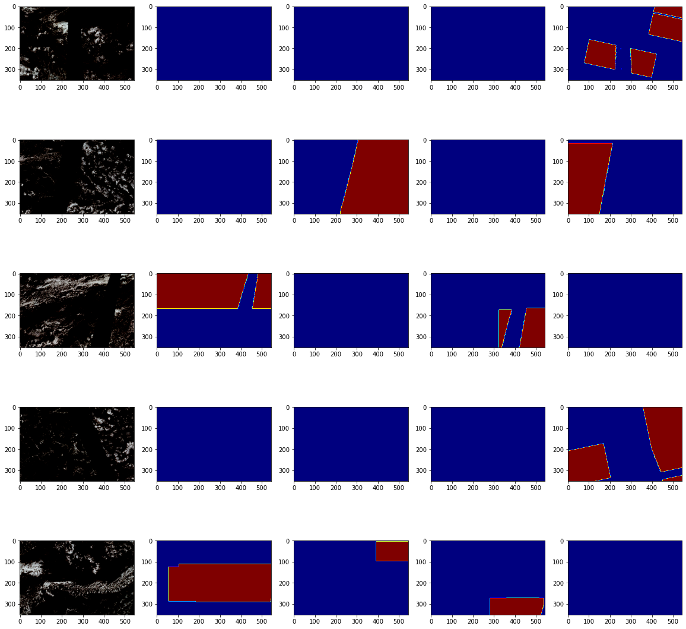

# Cloud-Pattern-Segmentation
### the aim of this project is to utomate the process of analysing Stelite image to segment cloud patterns.
### Keras and Tensorflow is used to train Unet with differetn encoders on Tesla K80 GPU
### The image below shows images in the following order:  original image , Fish pattern segmentation, Flower pattern segmentation,  Gravel pattern segmentation and sugar pattern segmenetation

### For the model files , kindly mail me at sagarkarki136@gmail.com and I will send them to you.
